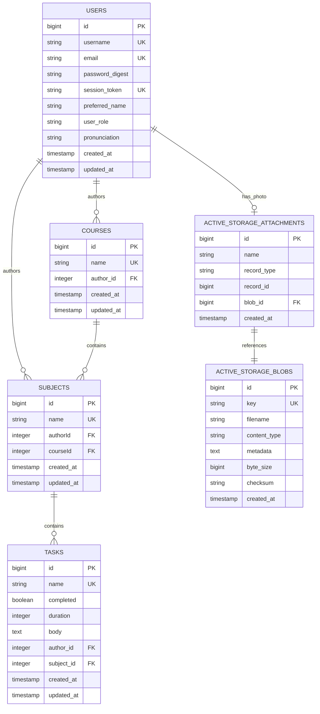

# Database Entity Relationship Diagram

**Version:** 2.0.0
**Last Updated:** January 2026

---

## Entity Relationship Diagram

```
┌─────────────────────────────────────────────────────────────────────────────────────┐
│                              DATABASE SCHEMA                                         │
│                           PostgreSQL + ActiveStorage                                 │
└─────────────────────────────────────────────────────────────────────────────────────┘


  ┌──────────────────────────────────────────────────────────────┐
  │                          USERS                                │
  ├──────────────────────────────────────────────────────────────┤
  │ PK  id              BIGSERIAL                                │
  │     username        VARCHAR          NOT NULL, UNIQUE        │
  │     email           VARCHAR          NOT NULL, UNIQUE        │
  │     password_digest VARCHAR          NOT NULL                │
  │     session_token   VARCHAR          NOT NULL, UNIQUE        │
  │     preferred_name  VARCHAR                                  │
  │     user_role       VARCHAR          NOT NULL                │
  │     pronunciation   VARCHAR                                  │
  │     created_at      TIMESTAMP        NOT NULL                │
  │     updated_at      TIMESTAMP        NOT NULL                │
  ├──────────────────────────────────────────────────────────────┤
  │ IDX  index_users_on_email          UNIQUE                    │
  │ IDX  index_users_on_username       UNIQUE                    │
  │ IDX  index_users_on_session_token  UNIQUE                    │
  └────────────────────────────┬─────────────────────────────────┘
                               │
                               │ 1:M (author_id)
                               │
            ┌──────────────────┴──────────────────┐
            │                                     │
            ▼                                     ▼
  ┌─────────────────────────────┐    ┌─────────────────────────────┐
  │         COURSES             │    │         SUBJECTS            │
  ├─────────────────────────────┤    ├─────────────────────────────┤
  │ PK  id         BIGSERIAL    │    │ PK  id         BIGSERIAL    │
  │     name       VARCHAR      │    │     name       VARCHAR      │
  │                NOT NULL     │    │                             │
  │                UNIQUE       │    │                UNIQUE       │
  │ FK  author_id  INTEGER      │    │ FK  authorId   INTEGER      │
  │                NOT NULL     │    │                NOT NULL     │
  │     created_at TIMESTAMP    │    │ FK  courseId   INTEGER      │
  │                NOT NULL     │    │                NOT NULL     │
  │     updated_at TIMESTAMP    │    │     created_at TIMESTAMP    │
  │                NOT NULL     │    │                NOT NULL     │
  ├─────────────────────────────┤    │     updated_at TIMESTAMP    │
  │ IDX  index_courses_on_name  │    │                NOT NULL     │
  │      UNIQUE                 │    ├─────────────────────────────┤
  └──────────────┬──────────────┘    │ IDX  index_subjects_on_name │
                 │                   │      UNIQUE                 │
                 │ 1:M (courseId)    └──────────────┬──────────────┘
                 │                                  │
                 └──────────────────┬───────────────┘
                                    │
                                    │ 1:M (subject_id)
                                    │
                                    ▼
                     ┌─────────────────────────────┐
                     │           TASKS             │
                     ├─────────────────────────────┤
                     │ PK  id         BIGSERIAL    │
                     │     name       VARCHAR      │
                     │                NOT NULL     │
                     │                UNIQUE       │
                     │     completed  BOOLEAN      │
                     │                NOT NULL     │
                     │     duration   INTEGER      │
                     │                NOT NULL     │
                     │     body       TEXT         │
                     │                NOT NULL     │
                     │ FK  author_id  INTEGER      │
                     │                NOT NULL     │
                     │ FK  subject_id INTEGER      │
                     │                NOT NULL     │
                     │     created_at TIMESTAMP    │
                     │                NOT NULL     │
                     │     updated_at TIMESTAMP    │
                     │                NOT NULL     │
                     ├─────────────────────────────┤
                     │ IDX  index_tasks_on_name    │
                     │      UNIQUE                 │
                     └─────────────────────────────┘


                          ACTIVESTORAGE TABLES
  ┌─────────────────────────────────────────────────────────────────────────┐
  │                                                                         │
  │   ┌─────────────────────────────┐     ┌─────────────────────────────┐  │
  │   │  ACTIVE_STORAGE_BLOBS       │     │ ACTIVE_STORAGE_ATTACHMENTS  │  │
  │   ├─────────────────────────────┤     ├─────────────────────────────┤  │
  │   │ PK  id           BIGSERIAL  │     │ PK  id           BIGSERIAL  │  │
  │   │     key          VARCHAR    │◄────│ FK  blob_id      BIGINT     │  │
  │   │                  NOT NULL   │     │                  NOT NULL   │  │
  │   │                  UNIQUE     │     │     name         VARCHAR    │  │
  │   │     filename     VARCHAR    │     │                  NOT NULL   │  │
  │   │                  NOT NULL   │     │     record_type  VARCHAR    │  │
  │   │     content_type VARCHAR    │     │                  NOT NULL   │  │
  │   │     metadata     TEXT       │     │     record_id    BIGINT     │  │
  │   │     byte_size    BIGINT     │     │                  NOT NULL   │  │
  │   │                  NOT NULL   │     │     created_at   TIMESTAMP  │  │
  │   │     checksum     VARCHAR    │     │                  NOT NULL   │  │
  │   │                  NOT NULL   │     │                             │  │
  │   │     created_at   TIMESTAMP  │     │ IDX on (record_type,        │  │
  │   │                  NOT NULL   │     │         record_id, name,    │  │
  │   │                             │     │         blob_id) UNIQUE     │  │
  │   │ IDX on key UNIQUE           │     │                             │  │
  │   └─────────────────────────────┘     └─────────────────────────────┘  │
  │                                                                         │
  │   Usage: User.has_one_attached :photo (profile pictures stored in S3)  │
  │                                                                         │
  └─────────────────────────────────────────────────────────────────────────┘
```

---

## Relationships Summary

```
┌────────────────────────────────────────────────────────────────────────────────────┐
│                            RELATIONSHIP DIAGRAM                                     │
└────────────────────────────────────────────────────────────────────────────────────┘

                                    ┌────────┐
                                    │  User  │
                                    └───┬────┘
                                        │
                    ┌───────────────────┼───────────────────┐
                    │                   │                   │
                    │ author            │ author            │ has_one_attached
                    ▼                   ▼                   ▼
              ┌──────────┐       ┌──────────┐        ┌───────────┐
              │  Course  │       │  Subject │        │   Photo   │
              └────┬─────┘       └────┬─────┘        │  (Blob)   │
                   │                  │              └───────────┘
                   │ has_many         │ has_many
                   │                  │ (belongs_to)
                   ▼                  │
              ┌──────────┐            │
              │  Subject │◄───────────┘
              └────┬─────┘
                   │
                   │ has_many (commented out)
                   ▼
              ┌──────────┐
              │   Task   │
              └──────────┘
```

---

## Model Associations (Current Implementation)

### User Model
```ruby
class User < ApplicationRecord
  has_one_attached :photo          # AWS S3 profile picture
  has_many :courses                # Courses authored by user
  has_many :subjects               # Subjects authored by user
end
```

### Course Model
```ruby
class Course < ApplicationRecord
  belongs_to :author, class_name: :User, foreign_key: :author_id
  has_many :subjects               # Subjects in this course
end
```

### Subject Model
```ruby
class Subject < ApplicationRecord
  belongs_to :author, class_name: :User, foreign_key: :authorId
  belongs_to :course, class_name: :Course, foreign_key: :courseId
  # has_many :tasks                # COMMENTED OUT - needs implementation
end
```

### Task Model
```ruby
class Task < ApplicationRecord
  # belongs_to :author, class_name: :User, foreign_key: :author_id   # COMMENTED
  # belongs_to :subject, class_name: :Subject, foreign_key: :subject_id  # COMMENTED
end
```

---

## Known Issues

### 1. Inconsistent Naming Convention
The database uses mixed naming conventions:

| Table | Column | Convention |
|-------|--------|------------|
| courses | `author_id` | snake_case |
| subjects | `authorId` | camelCase |
| subjects | `courseId` | camelCase |
| tasks | `author_id` | snake_case |
| tasks | `subject_id` | snake_case |

**Recommendation:** Migrate `authorId` and `courseId` to `author_id` and `course_id` for consistency.

### 2. Missing Foreign Key Constraints
The schema lacks explicit foreign key constraints at the database level. Only `active_storage_attachments` has a foreign key constraint to `active_storage_blobs`.

**Recommendation:** Add foreign key constraints:
```ruby
add_foreign_key :courses, :users, column: :author_id
add_foreign_key :subjects, :users, column: :authorId  # (after rename)
add_foreign_key :subjects, :courses, column: :courseId  # (after rename)
add_foreign_key :tasks, :users, column: :author_id
add_foreign_key :tasks, :subjects, column: :subject_id
```

### 3. Commented Model Associations
Task model has commented-out `belongs_to` associations, indicating incomplete refactoring.

---

## Indexes

| Table | Index Name | Columns | Type |
|-------|------------|---------|------|
| users | index_users_on_email | email | UNIQUE |
| users | index_users_on_username | username | UNIQUE |
| users | index_users_on_session_token | session_token | UNIQUE |
| courses | index_courses_on_name | name | UNIQUE |
| subjects | index_subjects_on_name | name | UNIQUE |
| tasks | index_tasks_on_name | name | UNIQUE |
| active_storage_blobs | index_active_storage_blobs_on_key | key | UNIQUE |
| active_storage_attachments | index_active_storage_attachments_uniqueness | record_type, record_id, name, blob_id | UNIQUE |
| active_storage_attachments | index_active_storage_attachments_on_blob_id | blob_id | BTREE |

---

## Mermaid Diagram


