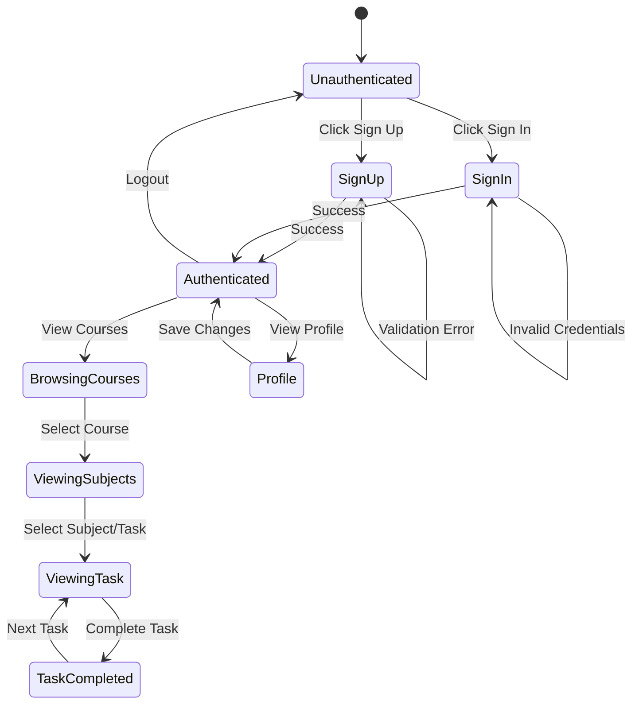

# User Flow Diagrams

**Version:** 2.0.0
**Last Updated:** January 2026

---

## User Journey Overview

```
┌─────────────────────────────────────────────────────────────────────────────────────┐
│                          USER JOURNEY MAP                                            │
└─────────────────────────────────────────────────────────────────────────────────────┘

  New User                                          Returning User
      │                                                   │
      ▼                                                   ▼
┌───────────┐                                      ┌───────────┐
│  Landing  │                                      │  Landing  │
│   Page    │                                      │   Page    │
│ (Splash)  │                                      │ (Splash)  │
└─────┬─────┘                                      └─────┬─────┘
      │                                                   │
      │ Click "Sign Up"                                   │ Click "Sign In"
      ▼                                                   ▼
┌───────────┐                                      ┌───────────┐
│  Sign Up  │                                      │  Sign In  │
│   Form    │                                      │   Form    │
└─────┬─────┘                                      └─────┬─────┘
      │                                                   │
      │ Submit                                            │ Submit
      ▼                                                   ▼
┌───────────┐                                      ┌───────────┐
│  Account  │                                      │  Session  │
│  Created  │                                      │  Started  │
└─────┬─────┘                                      └─────┬─────┘
      │                                                   │
      └───────────────────────┬───────────────────────────┘
                              │
                              ▼
                       ┌───────────┐
                       │   Hall    │
                       │  (Main)   │
                       │  Content  │
                       └─────┬─────┘
                              │
          ┌───────────────────┼───────────────────┐
          │                   │                   │
          ▼                   ▼                   ▼
   ┌───────────┐       ┌───────────┐       ┌───────────┐
   │  Browse   │       │   View    │       │  Profile  │
   │  Courses  │       │  Tasks    │       │  Settings │
   └───────────┘       └───────────┘       └───────────┘
```

---

## 1. Registration Flow

```
┌─────────────────────────────────────────────────────────────────────────────────────┐
│                            REGISTRATION FLOW                                         │
└─────────────────────────────────────────────────────────────────────────────────────┘

     User                    Frontend                    Backend
       │                        │                           │
       │  1. Navigate to /signup│                           │
       │───────────────────────►│                           │
       │                        │                           │
       │  2. Display SignUp form│                           │
       │◄───────────────────────│                           │
       │                        │                           │
       │  3. Fill form:         │                           │
       │     - username         │                           │
       │     - email            │                           │
       │     - password         │                           │
       │     - preferred_name   │                           │
       │     - pronunciation    │                           │
       │     - user_role        │                           │
       │                        │                           │
       │  4. Submit form        │                           │
       │───────────────────────►│                           │
       │                        │                           │
       │                        │  5. POST /api/users       │
       │                        │──────────────────────────►│
       │                        │                           │
       │                        │                    6. Validate:
       │                        │                       - username unique?
       │                        │                       - email unique?
       │                        │                       - password >= 6 chars?
       │                        │                           │
       │                        │                           │
       │                        │         ┌─────────────────┼─────────────────┐
       │                        │         │                 │                 │
       │                        │    [VALID]           [INVALID]              │
       │                        │         │                 │                 │
       │                        │         ▼                 ▼                 │
       │                        │  7a. Create user   7b. Return errors       │
       │                        │      BCrypt hash        ["Username taken"]  │
       │                        │      session_token                          │
       │                        │         │                 │                 │
       │                        │◄────────┴─────────────────┘                 │
       │                        │                           │
       │                        │  8a. Dispatch             │
       │                        │      RECEIVE_CURRENT_USER │
       │                        │                           │
       │                        │  8b. Dispatch             │
       │                        │      RECEIVE_SESSION_ERRORS│
       │                        │                           │
       │  9a. Redirect to /     │                           │
       │◄───────────────────────│                           │
       │                        │                           │
       │  9b. Display errors    │                           │
       │◄───────────────────────│                           │
       │                        │                           │
```

### SignUp Form Fields

| Field | Type | Required | Validation |
|-------|------|----------|------------|
| username | text | Yes | Unique, presence |
| email | email | Yes | Unique, presence |
| password | password | Yes | Min 6 characters |
| preferred_name | text | No | - |
| pronunciation | text | No | - |
| user_role | select | Yes | "student" or "instructor" |

---

## 2. Login Flow

```
┌─────────────────────────────────────────────────────────────────────────────────────┐
│                              LOGIN FLOW                                              │
└─────────────────────────────────────────────────────────────────────────────────────┘

     User                    Frontend                    Backend
       │                        │                           │
       │  1. Navigate to /signIn│                           │
       │───────────────────────►│                           │
       │                        │                           │
       │  2. Display SignIn form│                           │
       │◄───────────────────────│                           │
       │                        │                           │
       │  3. Enter credentials  │                           │
       │     - username         │                           │
       │     - password         │                           │
       │                        │                           │
       │  4. Submit form        │                           │
       │───────────────────────►│                           │
       │                        │                           │
       │                        │  5. POST /api/sessions    │
       │                        │──────────────────────────►│
       │                        │                           │
       │                        │                    6. Authenticate:
       │                        │                       - Find by username
       │                        │                       - BCrypt.is_password?
       │                        │                           │
       │                        │         ┌─────────────────┼─────────────────┐
       │                        │         │                 │                 │
       │                        │    [VALID]           [INVALID]              │
       │                        │         │                 │                 │
       │                        │         ▼                 ▼                 │
       │                        │  7a. Reset token   7b. Return 401          │
       │                        │      Set session      "Invalid credentials" │
       │                        │      Return user                            │
       │                        │         │                 │                 │
       │                        │◄────────┴─────────────────┘                 │
       │                        │                           │
       │                        │  8. Update Redux store    │
       │                        │                           │
       │  9. Redirect to Hall   │                           │
       │◄───────────────────────│                           │
       │                        │                           │
```

---

## 3. Learning Content Flow

```
┌─────────────────────────────────────────────────────────────────────────────────────┐
│                         LEARNING CONTENT FLOW                                        │
└─────────────────────────────────────────────────────────────────────────────────────┘

     User                    Frontend                    Backend
       │                        │                           │
       │  1. Authenticated,     │                           │
       │     viewing Hall       │                           │
       │                        │                           │
       │                        │  2. GET /api/courses      │
       │                        │──────────────────────────►│
       │                        │                           │
       │                        │  3. Return courses list   │
       │                        │◄──────────────────────────│
       │                        │                           │
       │  4. Display courses    │                           │
       │     in sidebar         │                           │
       │◄───────────────────────│                           │
       │                        │                           │
       │  5. Click on course    │                           │
       │───────────────────────►│                           │
       │                        │                           │
       │                        │  6. GET /api/subjects     │
       │                        │──────────────────────────►│
       │                        │                           │
       │                        │  7. Return subjects       │
       │                        │◄──────────────────────────│
       │                        │                           │
       │  8. Display subjects   │                           │
       │     (modules)          │                           │
       │◄───────────────────────│                           │
       │                        │                           │
       │  9. Click on subject   │                           │
       │───────────────────────►│                           │
       │                        │                           │
       │                        │  10. GET /api/tasks       │
       │                        │──────────────────────────►│
       │                        │                           │
       │                        │  11. Return tasks         │
       │                        │◄──────────────────────────│
       │                        │                           │
       │  12. Display tasks     │                           │
       │      (lessons)         │                           │
       │◄───────────────────────│                           │
       │                        │                           │
       │  13. Click on task     │                           │
       │───────────────────────►│                           │
       │                        │                           │
       │  14. Render markdown   │                           │
       │      content           │                           │
       │◄───────────────────────│                           │
       │                        │                           │
```

---

## 4. Task Completion Flow

```
┌─────────────────────────────────────────────────────────────────────────────────────┐
│                         TASK COMPLETION FLOW                                         │
└─────────────────────────────────────────────────────────────────────────────────────┘

     User                    Frontend                    Backend
       │                        │                           │
       │  1. Viewing task       │                           │
       │     content            │                           │
       │                        │                           │
       │  2. Click "Complete"   │                           │
       │───────────────────────►│                           │
       │                        │                           │
       │                        │  3. PATCH /api/tasks/:id  │
       │                        │     { completed: true }   │
       │                        │──────────────────────────►│
       │                        │                           │
       │                        │                    4. Update task
       │                        │                       completed = true
       │                        │                           │
       │                        │  5. Return updated task   │
       │                        │◄──────────────────────────│
       │                        │                           │
       │                        │  6. Update Redux store    │
       │                        │     RECEIVE_TASK          │
       │                        │                           │
       │  7. Show completion    │                           │
       │     indicator          │                           │
       │◄───────────────────────│                           │
       │                        │                           │
       │  8. Auto-advance to    │                           │
       │     next task (opt)    │                           │
       │◄───────────────────────│                           │
       │                        │                           │
```

---

## 5. Logout Flow

```
┌─────────────────────────────────────────────────────────────────────────────────────┐
│                              LOGOUT FLOW                                             │
└─────────────────────────────────────────────────────────────────────────────────────┘

     User                    Frontend                    Backend
       │                        │                           │
       │  1. Click "Logout"     │                           │
       │───────────────────────►│                           │
       │                        │                           │
       │                        │  2. DELETE /api/sessions  │
       │                        │──────────────────────────►│
       │                        │                           │
       │                        │                    3. Clear session
       │                        │                       session[:session_token] = nil
       │                        │                           │
       │                        │  4. Return empty response │
       │                        │◄──────────────────────────│
       │                        │                           │
       │                        │  5. Dispatch              │
       │                        │     LOGOUT_CURRENT_USER   │
       │                        │                           │
       │  6. Redirect to Splash │                           │
       │◄───────────────────────│                           │
       │                        │                           │
```

---

## Route Protection

```
┌─────────────────────────────────────────────────────────────────────────────────────┐
│                          ROUTE PROTECTION                                            │
└─────────────────────────────────────────────────────────────────────────────────────┘

                            ┌────────────────────────┐
                            │     User Navigates     │
                            │       to Route         │
                            └───────────┬────────────┘
                                        │
                                        ▼
                            ┌────────────────────────┐
                            │   Check Route Type     │
                            └───────────┬────────────┘
                                        │
                    ┌───────────────────┼───────────────────┐
                    │                   │                   │
                    ▼                   ▼                   ▼
             ┌────────────┐     ┌────────────┐      ┌────────────┐
             │ AuthRoute  │     │ Protected  │      │  Public    │
             │ /signup    │     │  Route     │      │  Route     │
             │ /signIn    │     │ /profile   │      │ /          │
             └─────┬──────┘     │ /          │      └─────┬──────┘
                   │            │ (w/ auth)  │            │
                   │            └─────┬──────┘            │
                   │                  │                   │
                   ▼                  ▼                   │
          ┌──────────────┐   ┌──────────────┐            │
          │ Is Logged In?│   │ Is Logged In?│            │
          └───────┬──────┘   └───────┬──────┘            │
                  │                  │                   │
           ┌──────┴──────┐    ┌──────┴──────┐            │
           │             │    │             │            │
        [YES]         [NO]  [YES]        [NO]           │
           │             │    │             │            │
           ▼             ▼    ▼             ▼            │
      ┌─────────┐  ┌─────────┐  ┌─────────┐  ┌─────────┐│
      │Redirect │  │ Render  │  │ Render  │  │Redirect ││
      │ to /    │  │Component│  │Component│  │/signIn  ││
      └─────────┘  └─────────┘  └─────────┘  └─────────┘│
                                                        │
                                               ┌────────┴────────┐
                                               │ Render Component │
                                               └─────────────────┘
```

---

## State Transitions


